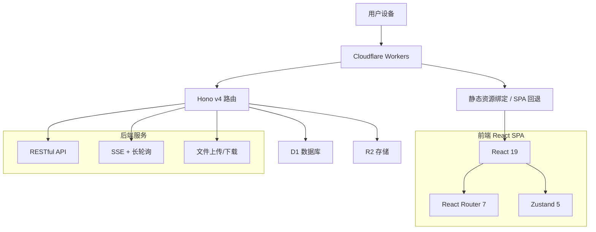
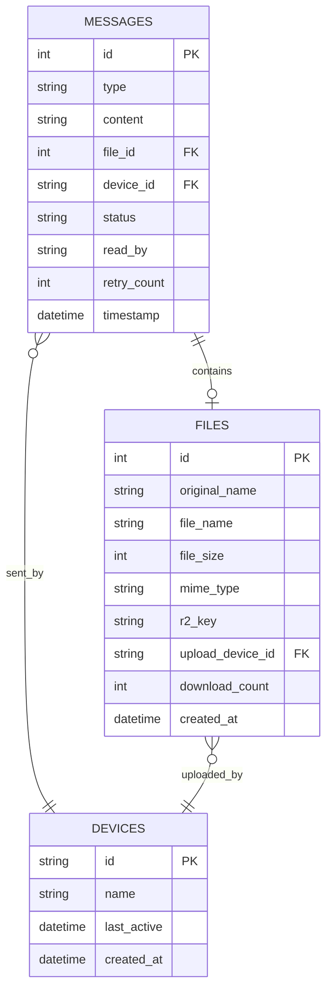

<div align="center">

# 🚀 微信文件传输助手 Web 应用

[](https://creativecommons.org/licenses/by-nc-sa/4.0/)
[](https://workers.cloudflare.com/)
[](https://hono.dev/)
[](https://react.dev/)
[](https://vite.dev/)
[](https://www.typescriptlang.org/)

**基于 Cloudflare Workers 的现代化微信文件传输助手**
*React 19 + Vite 8 + TypeScript 全栈重构版，跨设备文件传输与实时消息同步*

</div>

---

## ✨ 功能特性

| 🎯 核心功能 | 📱 用户体验 | 🔧 技术特色 |
|------------|------------|------------|
| 💬 **实时聊天** | 🎨 **WeChat风格UI** | ⚡ **边缘计算** |
| 📁 **文件传输** | 📱 **响应式设计** | 🛡️ **JWT 鉴权** |
| 🔐 **访问鉴权** | 🌟 **流畅动画** | 🚀 **自动扩容** |
| 🔄 **跨设备同步** | 🔍 **全量搜索** | 🔥 **深浅色主题** |
| 📝 **Markdown渲染** | 🤖 **AI 对话** | 🧩 **组件化架构** |
| 📱 **PWA支持** | 🎨 **AI 绘图** | 🗂️ **客户端路由** |

### 🎯 核心功能详解

- 💬 **智能聊天系统** — 实时文本消息、消息历史、按设备区分左右气泡、时间智能格式化
- 📁 **文件传输** — 支持任意格式，拖拽上传、剪贴板粘贴、多文件批量上传、带进度条、图片内联预览
- 📝 **Markdown 渲染** — 自动识别语法并渲染，支持源码/渲染视图切换，**渲染结果经 DOMPurify 消毒**
- 🔍 **全量搜索** — 关键词/类型/文件类型/时间范围组合筛选，结果高亮并支持一键定位回聊天
- 🤖 **AI 对话** — 接入 SiliconFlow（DeepSeek-R1），流式输出、思考过程可折叠、结果落库
- 🎨 **AI 绘图** — 接入 Kolors，可配置尺寸/步数/引导强度/负面提示词，产物自动存入聊天记录
- 🔄 **无缝同步** — SSE 实时推送，连续重连失败自动降级为长轮询
- 🔐 **访问鉴权** — 密码登录 + JWT 会话，登录失败次数限制，401 自动清理登录态
- 🧹 **数据清理** — `/clear-all` 命令，二次确认 + 确认码保护，数据库与存储双重清理
- 📱 **PWA** — 可安装到桌面、静态资源离线缓存、新版本更新提示

## 🏗️ 技术架构



| 层级 | 技术选型 | 说明 |
|------|---------|------|
| **前端框架** | React 19 | 函数组件 + Hooks，无类组件 |
| **构建工具** | Vite 8 | 极速冷启动，产物输出到 `dist/` |
| **类型系统** | TypeScript 7 | 前端与 Worker 全量类型覆盖，独立 tsconfig 隔离 DOM / Workers 类型 |
| **路由** | React Router 7 | `/login` 与 `/` 双路由，登录守卫 + 懒渲染 |
| **状态管理** | Zustand 5 | 鉴权 / 聊天 / UI 三个独立 store |
| **Markdown** | marked + DOMPurify | 渲染并消毒，防 XSS |
| **后端** | Hono 4 on Cloudflare Workers | 边缘计算、毫秒响应、自动扩容 |
| **数据库** | Cloudflare D1 (SQLite) | 消息、文件、设备三类数据 |
| **存储** | Cloudflare R2 | 对象存储，文件与 AI 绘图产物 |
| **静态托管** | Workers Static Assets | 托管 Vite 产物并处理 SPA 回退 |

## 📦 项目结构

```
📁 wxchat/
├── 📄 index.html                 # Vite HTML 入口
├── 📄 package.json               # 依赖与脚本
├── 📄 vite.config.ts             # 构建配置（含 /api 开发代理）
├── 📄 tsconfig.json              # 前端类型配置
├── 📄 tsconfig.node.json         # 构建脚本类型配置
├── 📄 wrangler.toml              # Workers / D1 / R2 / 静态资源绑定
├── 📄 .env.example               # AI 密钥等可选环境变量示例
│
├── 📁 src/                       # 🎨 前端源码
│   ├── 📄 main.tsx               # 应用入口
│   ├── 📄 App.tsx                # 应用外壳（鉴权初始化 + 全局浮层）
│   ├── 📄 router.tsx             # 路由表
│   ├── 📁 config/                # 配置中心（接口/UI/AI/命令/文案）
│   ├── 📁 types/                 # 领域类型定义
│   ├── 📁 lib/                   # 工具层（HTTP/令牌/Markdown/PWA/命令/流解析）
│   ├── 📁 api/                   # 接口封装（鉴权/消息/文件/搜索/AI）
│   ├── 📁 store/                 # Zustand 状态（auth/chat/ui）
│   ├── 📁 hooks/                 # 实时通信、口令编排、视口修复等
│   ├── 📁 components/            # 组件
│   │   ├── 📄 Modal.tsx / ConfirmDialog.tsx / ToastContainer.tsx
│   │   ├── 📄 RequireAuth.tsx
│   │   └── 📁 chat/              # 消息列表、气泡、输入区、各功能弹层
│   ├── 📁 pages/                 # LoginPage / ChatPage
│   └── 📁 styles/                # 设计系统（CSS 变量 + 基础/布局/消息/输入/弹层/移动端）
│
├── 📁 worker/                    # 🔧 后端服务（TypeScript）
│   ├── 📄 index.ts               # 应用入口与路由挂载
│   ├── 📄 auth.ts                # JWT 签发/校验与鉴权中间件
│   ├── 📄 types.ts               # 运行时绑定类型
│   ├── 📄 tsconfig.json          # Workers 独立类型配置
│   └── 📁 routes/                # messages / files / search / sync / realtime
│
├── 📁 public/                    # 原样拷贝到 dist 的静态资源
│   ├── 📄 manifest.json          # PWA 应用清单
│   ├── 📄 sw.js                  # Service Worker（运行时缓存策略）
│   └── 📁 icons/                 # 各平台图标
│
└── 📁 database/
    └── 📄 schema.sql             # 数据库结构定义
```

## 🚀 快速开始

### 📋 前置要求

- ✅ **Cloudflare 账户** — [免费注册](https://dash.cloudflare.com/sign-up)
- ✅ **Node.js 20+** — 建议使用当前 LTS
- ✅ **Git**

### ⚡ 部署步骤

```bash
# 1️⃣ 克隆项目
git clone https://github.com/xiyewuqiu/wxchat.git
cd wxchat

# 2️⃣ 安装依赖
npm install

# 3️⃣ 登录 Cloudflare
npx wrangler login

# 4️⃣ 创建 D1 数据库与 R2 存储桶
npx wrangler d1 create wxchat
npx wrangler r2 bucket create wxchat

# 5️⃣ 把上一步得到的 database_id 填入 wrangler.toml

# 6️⃣ 初始化数据库
npm run db:init

# 7️⃣ 配置访问密码（见下方“密码配置”）

# 8️⃣ 构建并部署
npm run deploy
```

### 🔐 密码配置

进入 [Cloudflare Dashboard](https://dash.cloudflare.com/) → **Workers & Pages** → **wxchat** → **设置** → **变量和机密**，配置：

| 变量 | 说明 |
|------|------|
| `ACCESS_PASSWORD` | 访问密码，登录时使用 |
| `JWT_SECRET` | 32 位以上随机字符串，用于签发会话令牌 |
| `SESSION_EXPIRE_HOURS` | 会话有效期（小时），默认 `24` |

> ⚠️ `wrangler.toml` 中的 `[vars]` 仅为本地开发默认值，生产环境请务必在控制台覆盖，切勿使用示例密钥。

### 🤖 AI 能力配置（可选）

AI 对话与 AI 绘图依赖 SiliconFlow 的 API Key，通过环境变量注入：

```bash
cp .env.example .env
# 编辑 .env 填入 VITE_AI_API_KEY / VITE_IMAGE_GEN_API_KEY
```

未配置时回退到内置默认值；**这两个密钥会随前端产物下发到浏览器，仅适合自用场景**，请勿在公开部署中依赖它们做额度保护。

### 🗄️ 数据库初始化

```bash
# 命令行初始化（本地或远程）
npm run db:init

# 仅初始化本地开发库
npx wrangler d1 execute wxchat --local --file=./database/schema.sql
```

也可在 Cloudflare 控制台的 D1 → 控制台 中粘贴 `database/schema.sql` 内容执行。

验证是否就绪：访问 `https://你的域名/api/health`，应返回 `{"success":true,"status":"ok","hasDB":true,"hasR2":true}`。

## 💻 本地开发

```bash
# 终端 1：启动后端（Workers + 本地 D1/R2，默认 http://127.0.0.1:8787）
npm run worker:dev

# 终端 2：启动前端（Vite，默认 http://localhost:5173，/api 自动代理到 8787）
npm run dev
```

常用脚本：

| 命令 | 作用 |
|------|------|
| `npm run dev` | 启动 Vite 开发服务器 |
| `npm run worker:dev` | 启动 Wrangler 本地后端 |
| `npm run typecheck` | 前端 + 构建脚本 + Worker 三份类型检查 |
| `npm run build` | 类型检查 + 构建到 `dist/` |
| `npm run preview` | 预览构建产物 |
| `npm run deploy` | 构建并部署到 Cloudflare |
| `npm run db:init` | 执行数据库结构脚本 |

## 📱 使用指南

### 🎮 基础操作

| 功能 | 操作方式 | 说明 |
|------|---------|------|
| 💬 发送消息 | 输入后点发送或按 `Enter` | `Shift + Enter` 换行 |
| 📁 上传文件 | 点 📁 按钮 / 拖拽到页面 / `Ctrl + V` 粘贴 | 支持多文件批量上传 |
| 📝 视图切换 | 点击气泡右下角 📝 | 在渲染视图与源码视图间切换 |
| ⬇️ 下载文件 | 点击文件气泡的下载按钮 | 保持原始文件名 |
| 🔍 搜索 | 功能菜单 → 搜索 | 支持关键词/类型/文件类型/时间组合筛选 |
| 🤖 AI 对话 | 功能菜单 → AI助手，或消息以 `🤖` 开头 | 流式输出，思考过程可折叠 |
| 🎨 AI 绘图 | 功能菜单 → AI绘画 | 生成结果自动存入聊天记录 |
| 📱 安装应用 | 功能菜单 → PWA管理，或输入 `/pwa` | 支持添加到主屏幕 |

### ⌨️ 文本命令

| 命令 | 作用 |
|------|------|
| `/clear-all`、`清空数据`、`/清空`、`clear all` | 清空全部消息与文件（需二次确认 + 确认码 `1234`） |
| `/logout`、`/登出`、`logout`、`登出` | 退出登录 |
| `/pwa`、`/install`、`/安装`、`pwa`、`install`、`安装` | 检查 PWA 状态并引导安装 |

## 🔧 API 接口文档

除 `/api/auth/*` 与 `/api/health` 外，所有接口都需要 `Authorization: Bearer <token>`。

### 🔐 鉴权

| 方法 | 路径 | 说明 |
|------|------|------|
| `POST` | `/api/auth/login` | 请求体 `{ password }`，返回 `{ token, expiresIn }` |
| `GET` | `/api/auth/verify` | 校验令牌，返回 `{ valid, payload }` |
| `POST` | `/api/auth/logout` | 登出（令牌由前端清理） |
| `GET` | `/api/health` | 健康检查，含 D1/R2 绑定状态 |

### 💬 消息

**`GET /api/messages?limit=50&offset=0`**

按时间倒序取最近 `limit` 条后反转为升序返回，因此 `offset` 表示“跳过最新的 N 条”，用于向上翻页加载历史。响应包含 `total`（消息总数），前端据此精确判断是否还有更早的消息。

```json
{
  "success": true,
  "data": [
    {
      "id": 1,
      "type": "text",
      "content": "Hello World",
      "device_id": "web-1750000000000-abc",
      "timestamp": "2025-06-17T00:00:00Z",
      "original_name": null,
      "file_size": null,
      "mime_type": null,
      "r2_key": null
    }
  ],
  "total": 1,
  "limit": 50,
  "offset": 0
}
```

**`POST /api/messages`** — 请求体 `{ content, deviceId }`

### 📁 文件

| 方法 | 路径 | 说明 |
|------|------|------|
| `POST` | `/api/files/upload` | `multipart/form-data`，字段 `file` 与 `deviceId` |
| `GET` | `/api/files/download/:r2Key` | 下载文件并累加下载次数 |

### 🔍 搜索

**`GET /api/search?q=关键词&type=all&timeRange=all&fileType=all&deviceId=all&limit=100&offset=0`**

- `type`：`all` / `text` / `file`
- `timeRange`：`all` / `today` / `yesterday` / `week` / `month`
- `fileType`：`all` / `image` / `video` / `audio` / `document` / `archive` / `text` / `code`

关键词在「消息内容」与「文件名」之间是 **OR** 关系，各类筛选条件之间是 **AND** 关系。

**`GET /api/search/suggestions?q=关键词`** — 基于历史消息内容的去重建议，少于 2 个字符返回空。

### 🔄 同步与实时

| 方法 | 路径 | 说明 |
|------|------|------|
| `POST` | `/api/sync` | 上报设备 `{ deviceId, deviceName }` |
| `GET` | `/api/events?deviceId=&token=` | SSE 推送（`connection` / `message` / `heartbeat` 事件） |
| `GET` | `/api/poll?deviceId=&lastMessageId=&timeout=30` | 长轮询，SSE 的降级方案 |

### 🤖 AI 与清理

| 方法 | 路径 | 说明 |
|------|------|------|
| `POST` | `/api/ai/message` | 落库 AI 内容 `{ content, deviceId, type }`，`type` 为 `ai_response` / `ai_thinking`，服务端以 `[AI] ` / `[AI-THINKING] ` 前缀区分 |
| `POST` | `/api/clear-all` | 请求体 `{ confirmCode: "1234" }`，清空消息、文件与 R2 对象 |

## 🗄️ 数据库设计



> ⏱️ `timestamp` 由 SQLite `CURRENT_TIMESTAMP` 生成（UTC），接口统一转换为 ISO 8601（`2025-06-17T00:00:00Z`）返回，前端按 UTC 解析后再本地化展示。

## 🚀 部署

### 🌍 生产部署

```bash
npm run deploy
```

`npm run deploy` 会先执行类型检查与 Vite 构建，再由 Wrangler 上传 Worker 与 `dist/` 静态资源。

### 🤖 GitHub Actions 自动部署

```yaml
name: Deploy to Cloudflare Workers

on:
  push:
    branches: [ main ]

jobs:
  deploy:
    runs-on: ubuntu-latest
    steps:
      - uses: actions/checkout@v4
      - uses: actions/setup-node@v4
        with:
          node-version: '20'
      - run: npm ci
      - uses: cloudflare/wrangler-action@v3
        with:
          apiToken: ${{ secrets.CLOUDFLARE_API_TOKEN }}
          command: deploy
```

在 GitHub Secrets 中添加 `CLOUDFLARE_API_TOKEN` 即可。

## 🔧 故障排除

<details>
<summary><strong>❌ HTTP 500 / 表不存在</strong></summary>

数据库未初始化。访问 `/api/health` 确认绑定状态，然后执行 `npm run db:init` 或按上文在 D1 控制台执行 `database/schema.sql`。
</details>

<details>
<summary><strong>🔗 提示“数据库配置错误：DB绑定未找到”</strong></summary>

检查 `wrangler.toml` 中 `[[d1_databases]]` 的 `binding` 是否为 `DB`、`database_id` 是否与云端一致。
</details>

<details>
<summary><strong>📁 文件上传失败</strong></summary>

确认 `[[r2_buckets]]` 的 `binding` 为 `R2`，且存储桶已创建（`npx wrangler r2 bucket list`）。
</details>

<details>
<summary><strong>🧭 前端刷新后 404</strong></summary>

Worker 会对未命中资源的请求回退到 `index.html`。若自定义了路由或反向代理，请确保非 `/api/*` 请求最终交给 Worker 处理。
</details>

<details>
<summary><strong>🎨 AI 功能不可用</strong></summary>

确认 `.env` 中的 `VITE_AI_API_KEY` / `VITE_IMAGE_GEN_API_KEY` 有效，或修改 `src/config/index.ts` 中的默认值后重新构建。
</details>

## 🤝 贡献指南

```bash
git clone https://github.com/xiyewuqiu/wxchat.git
cd wxchat
npm install
npm run worker:dev   # 终端 1
npm run dev          # 终端 2
npm run typecheck    # 提交前自检
```

提交信息遵循 [Conventional Commits](https://www.conventionalcommits.org/)：`feat` / `fix` / `docs` / `style` / `refactor` / `test` / `chore`。

代码约定：

- 组件与函数使用业务化命名，单一职责，避免无边界 `any`
- 外部输入（接口、文件、环境变量）在边界校验，内部不重复防御
- 注释只解释“为什么”，不翻译代码
- 样式沿用 `src/styles` 中的设计令牌，不硬编码颜色与间距

## 📄 开源许可证

本项目采用 [CC BY-NC-SA 4.0](https://creativecommons.org/licenses/by-nc-sa/4.0/) 许可证，**严禁商业用途**。

| ✅ 允许 | ❌ 禁止 |
|---------|--------|
| 个人学习与研究 | 商业销售或盈利 |
| 学术研究项目 | 企业商业部署 |
| 非营利性修改与分发 | 付费产品集成 |

商业授权请联系：[xiyewuqiu@gmail.com](mailto:xiyewuqiu@gmail.com)

---

<div align="center">

**Copyright (c) 2025 xiyewuqiu**

**⭐ 给项目点个 Star** | **🍴 Fork 并贡献代码** | **👀 Watch 获取更新**

</div>
